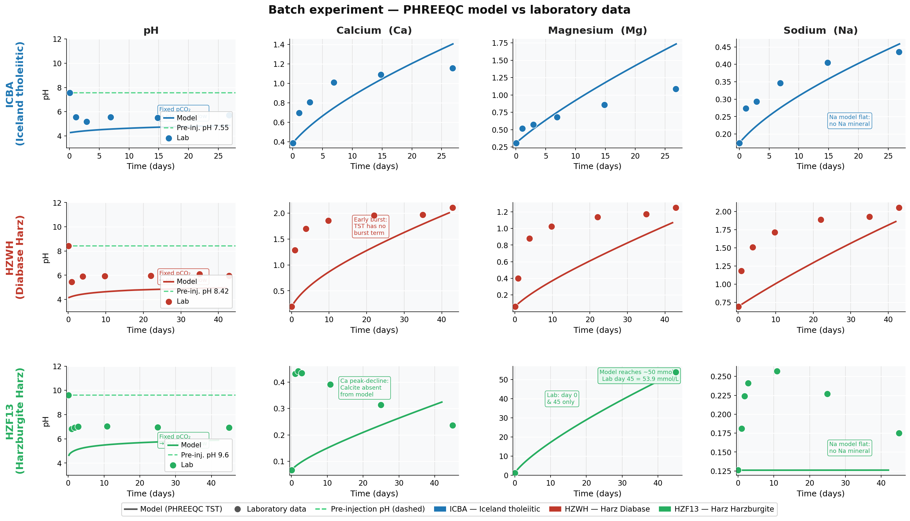
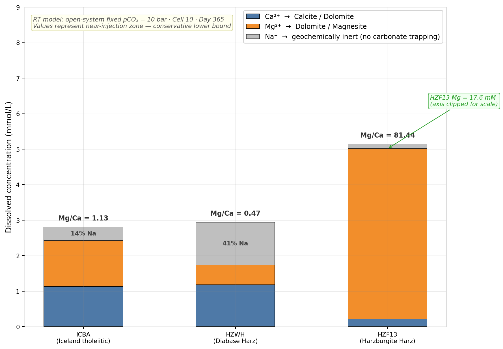
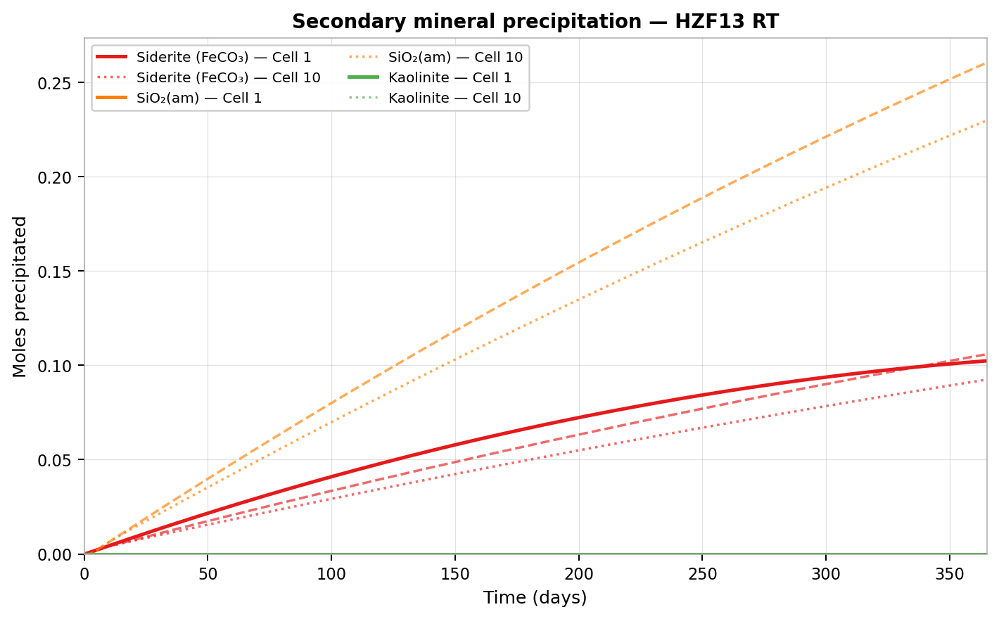
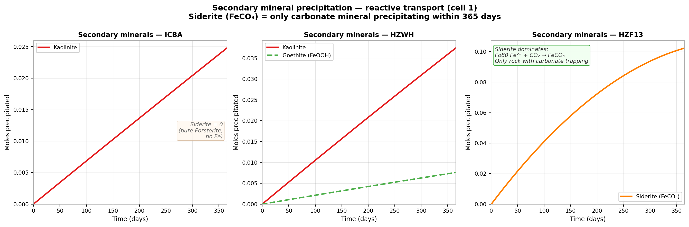

# CO₂ Mineralisation Screening: PHREEQC Reactive Transport Modelling

**Benchmarking Icelandic Tholeiitic and German Basaltic Rocks for CO₂ Storage**

> MSc Applied Geosciences thesis — RWTH Aachen University / Fraunhofer IEG, 2026  
> Author: **Joseph Turkson**  
> Conference: SPE German Section Student Technical Congress 2026

---

## What this project does

This repository contains the complete geochemical modelling workflow developed for my MSc thesis. Starting from laboratory dissolution experiments on three real rock samples, I built and calibrated PHREEQC kinetic models using Transition State Theory (TST) and ran 1D reactive transport simulations to rank candidate formations for CO₂ mineralisation storage.

The central question: **can German basaltic rocks replicate the CO₂ trapping performance of Icelandic basalt used at CarbFix?**

The answer is nuanced — and one German rock substantially outperforms the Icelandic benchmark on a key metric.

---

## The three rocks

| Code | Rock | Origin | Primary reactive minerals |
|------|------|--------|--------------------------|
| **ICBA** | Iceland tholeiitic basalt | Iceland | Bytownite 69% · Augite 16% · Forsterite 8% · Magnetite 7% |
| **HZWH** | Diabase (Harz) | Germany | Anorthite 35% · Albite 18% · Augite 15% · Hornblende 15% · Chamosite 15% |
| **HZF13** | Harzburgite (Harz) | Germany | Forsterite₈₀ 32% · Lizardite 55% · Augite 13% |

---

## Workflow overview

```
Lab autoclave experiment (60°C, pCO₂ = 10 bar, 42–45 days, closed system)
         │
         │  pH, Ca²⁺, Mg²⁺, Na⁺, K⁺ time series (6 sampling points)
         ▼
PHREEQC TST batch model (open system, fixed pCO₂ = 10 bar)
         │
         │  Surface area calibration per mineral (CarbFix thermodynamic database)
         ▼
1D Reactive transport model (10 cells · 200 shifts · 365 days)
         │
         │  No parameter re-fitting — calibrated SAs transferred directly
         ▼
Comparative carbonation potential ranking: HZF13 ≫ ICBA > HZWH
```

---

## Key results

### Batch calibration — model vs laboratory

All three rocks calibrated with cation endpoint errors below 6%, confirming TST kinetics are sufficient for CO₂ mineralisation screening.



**RMSE summary (PHREEQC batch model vs laboratory data)**

| Rock | pH | Ca (mmol/L) | Mg (mmol/L) | Na (mmol/L) | K (mmol/L) |
|------|----|-------------|-------------|-------------|------------|
| ICBA | 1.49 | 0.29 | 0.49 ᵃ | 0.07 | 0.27 |
| HZWH | 1.96 | 0.73 ᵇ | 0.43 | 0.48 | 0.30 |
| HZF13 | 2.40 | 0.25 | 2.13 ᶜ | 0.09 | 0.38 |

ᵃ Open-system boundary artefact — endpoint error +5.5%, not a calibration failure  
ᵇ TST lacks burst-dissolution term — day-42 endpoint error only −4.8%  
ᶜ Only 2 Mg lab datapoints available; endpoint error −5.5% confirms SA = 0.007 m²/g valid

> **pH note:** The model systematically underpredicts pH by 1.0–2.4 units. This is expected: PHREEQC holds pCO₂ fixed at 10 bar (open system) while the laboratory autoclave is closed — pCO₂ declines as rock dissolves, allowing pH to recover. TST dissolution rates are insensitive to pH in the 5–7 range at 60°C; cation calibration is unaffected.

---

### Reactive transport — divalent cation budget (Cell 10, Day 365)



| Rock | pH outlet | Ca²⁺ (mmol/L) | Mg²⁺ (mmol/L) | Na⁺ (mmol/L) | Ca+Mg (mmol/L) | Na fraction | Mg/Ca |
|------|-----------|----------------|----------------|--------------|-----------------|-------------|-------|
| ICBA | 4.75 | 1.14 | 1.29 | 0.38 | **2.43** | 13.7% | 1.13 |
| HZWH | 4.78 | 1.18 | 0.56 | 1.20 | **1.74** | 40.9% | 0.47 |
| HZF13 | 5.50 | 0.22 | 17.57 | 0.13 | **17.79** | 0.7% | 81.4 |

> **Why Na⁺ matters:** Sodium is geochemically inert — it cannot form carbonate minerals. HZWH wastes 40.9% of its dissolved ion budget on Na⁺ from Albite dissolution. HZF13 produces almost none (0.7%).

---

### Key finding — HZF13 is the only rock achieving carbonate trapping in year 1



Siderite (FeCO₃) precipitates at **0.09–0.10 mol per cell** across all 10 column cells within 365 days.  
Source reaction: Fe²⁺ from Forsterite₈₀ (Mg₁.₆Fe₀.₄SiO₄) + CO₂-charged fluid → FeCO₃↓

Magnesite saturation index reaches **−0.27 at Day 365** — Mg-carbonate trapping is imminent at longer timescales.

---

### Three-rock secondary mineral comparison



ICBA and HZWH produce only silicate clays (Kaolinite) and iron oxides (Goethite) — no carbonate minerals form within 365 days at fixed pCO₂ = 10 bar. Only HZF13, with its Fe-bearing Forsterite₈₀, achieves actual CO₂ mineral trapping.

---

### Carbonation potential ranking

```
HZF13  ≫  ICBA  >  HZWH
```

| Rock | Verdict | Reason |
|------|---------|--------|
| **HZF13** | 🟢 Priority | Forsterite₈₀ provides massive Mg²⁺ + Fe²⁺ pool · Siderite trapping in year 1 · Magnesite approaching saturation |
| **ICBA** | 🟡 Strong | Best CarbFix analogue · Balanced Ca+Mg · Low Na fraction (13.7%) |
| **HZWH** | 🔴 Limited | Albite-controlled · 40.9% inert Na⁺ · No carbonate trapping within 365 days |

---

## Repository structure

```
co2-mineralisation-phreeqc/
│
├── README.md
│
├── data/
│   ├── Fluid_analysis.xlsx          # Laboratory ICP/IC measurements (all 3 rocks)
│   └── Rates_input_corrected.phr    # PHREEQC rate constants (CarbFix database)
│
├── phreeqc_inputs/
│   ├── batch/
│   │   ├── Iceland_Basalt_v36.phr   # ICBA final calibrated batch model
│   │   ├── Diabase_Harz_v3.phr      # HZWH final calibrated batch model  
│   │   └── Harzburgite_Harz_v1.sel  # HZF13 batch model (SEL output)
│   └── reactive_transport/
│       ├── Iceland_Basalt_RT_v4.phr # ICBA RT model
│       ├── Diabase_Harz_RT_v2.phr   # HZWH RT model
│       └── Harzburgite_Harz_RT_v1.phr # HZF13 RT model
│
├── scripts/
│   ├── batch_calibration.py         # Parse SEL outputs → calibration figures
│   ├── reactive_transport.py        # Parse RT SEL outputs → breakthrough figures
│   ├── comparison_figures.py        # Generate 6 cross-rock comparison plots
│   └── utils.py                     # Shared data loading and plot styling
│
├── figures/
│   ├── batch/
│   ├── reactive_transport/
│   └── comparison/
│
└── results/
    └── RMSE_summary.csv
```

---

## How to reproduce

### Requirements

```bash
pip install pandas matplotlib numpy openpyxl scipy
```

PHREEQC 3.x must be installed separately: https://www.usgs.gov/software/phreeqc

### Run the models

```bash
# Run PHREEQC batch simulations
phreeqc phreeqc_inputs/batch/Iceland_Basalt_v36.phr Iceland_Basalt_v36.sel phreeqc.dat

# Then generate figures
python scripts/batch_calibration.py
python scripts/comparison_figures.py
python scripts/reactive_transport.py
```

### Output

All figures are written to `figures/`. Running the full pipeline takes approximately 2–5 minutes depending on PHREEQC version.

---

## Modelling approach — technical notes

### TST kinetic rate law

Dissolution rates follow the Transition State Theory formulation (Palandri & Kharaka 2004), implemented via the CarbFix geochemical database:

```
r = A · k · (1 - Ω)
```

where `A` is the reactive surface area (m²/g), `k` is the rate constant at 60°C, and `Ω` is the saturation ratio. Surface area is the **only free parameter** calibrated against laboratory data.

### Calibrated surface areas (m²/g)

| Rock | Mineral | SA (m²/g) |
|------|---------|-----------|
| ICBA | Bytownite | 0.020 |
| ICBA | Augite | 0.020 |
| ICBA | Forsterite | 0.001 |
| ICBA | Magnetite | 0.050 |
| HZF13 | Forsterite₈₀ | 0.007 |

### Reactive transport setup

- **Column:** 10 cells, 1D advective transport
- **Duration:** 200 shifts × 1.825 days/shift = 365 days
- **Boundary condition:** Fixed pCO₂ = 10 bar at inlet (near-injection zone, conservative lower bound on carbonation)
- **Parameter transfer:** Calibrated surface areas used directly — no re-fitting

---

## Skills demonstrated

| Skill | Tool / Method |
|-------|--------------|
| Geochemical modelling | PHREEQC 3 · TST kinetics · CarbFix database |
| Lab-to-model calibration | Surface area fitting · RMSE minimisation |
| Reactive transport | 1D advective column · breakthrough curve analysis |
| Rock–fluid interaction | Mineral dissolution · secondary precipitation · saturation index |
| CO₂ storage screening | Formation ranking · cation budget · carbonate trapping |
| Data analysis & visualisation | Python · pandas · matplotlib · openpyxl |

**Transferable domains:** CCS site characterisation · geothermal reservoir geochemistry · underground H₂/gas storage · wellbore integrity modelling

---

## References

1. Palandri, J.L. & Kharaka, Y.K. (2004). *A compilation of rate parameters of water-mineral interaction kinetics for application to geochemical modelling.* USGS Open File Report 2004-1068.
2. Oelkers, E.H. et al. (2008). *The CarbFix Pilot Project — storing carbon dioxide in basalt.* Energy Procedia, 1(1), 3641–3646.
3. Snæbjörnsdóttir, S.Ó. et al. (2020). *Carbon dioxide storage through mineral carbonation.* Nature Reviews Earth & Environment, 1(2), 90–102.
4. Steefel, C.I. et al. (2015). *Reactive transport codes for subsurface environmental simulation.* Computational Geosciences, 19(3), 445–478.
5. Helgeson, H.C. et al. (1984). *Thermodynamics of minerals, solutions, and melts.* American Journal of Science, 278, 1–229.

---

## Presentation

The SPE STC 2026 conference presentation is available in `presentations/STC2026_Turkson.pdf`.

---

## Contact

**Joseph Turkson**  
MSc Applied Geosciences · RWTH Aachen University / Fraunhofer IEG  
Available for industry roles from mid-2026

[](https://www.linkedin.com/in/joseph-turkson/)
[](https://github.com/Joexy1286)


*This repository was developed as part of MSc thesis research at RWTH Aachen University. The PHREEQC input files, calibration scripts, and all figures are original work.*
